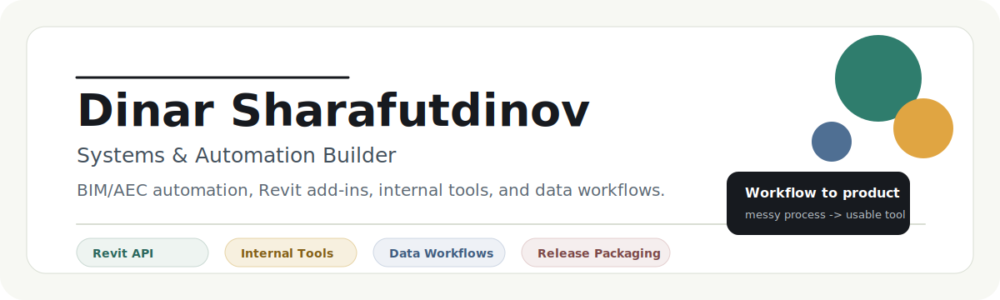
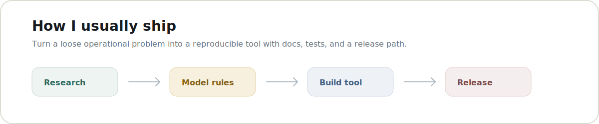

  

<h1 align="center">Dinar Sharafutdinov</h1>

  <strong>Systems & Automation Builder</strong> 
  BIM/AEC automation, Revit add-ins, internal tools, and data workflows.

  <a href="https://sharafutdinov.online">Website</a>
  |
  <a href="https://www.linkedin.com/in/sharafutdinovdi">LinkedIn</a>
  |
  <a href="mailto:sharafutdinov.di.dev@outlook.com">Email</a>

---

I build practical software for teams that lose time to manual repetition: Revit/BIM tools, workflow automation, internal web apps, data/reporting systems, and small products that turn scattered processes into repeatable tools.

My strongest proof domain is BIM/AEC, but the core work is broader: understand a messy workflow, model the decisions, and ship a tool that people can actually use.

## Focus

  

- Revit API add-ins with C#, .NET, WPF, installers, and release packaging.
- BIM data workflows around parameters, families, IFC, IDS, validation, and handoff reports.
- Internal tools with TypeScript, Next.js, Supabase, Python/FastAPI, and automation scripts.
- Productized utilities with clear docs, reproducible builds, and clean release artifacts.

## Current Work

| Project | What it proves | Status |
|---|---|---|
| DSTools | Revit automation ecosystem with desktop, web, and plugin surfaces | In development |
| IdsPreflight | IDS/IFC preflight and reporting before Revit export | Preparing public release |
| sharafutdinov.online | Portfolio, services, project notes, and public writing | Live |
| Revit Day By Day | Revit API practice and public learning history | Public archive |

## Stack

`C#` | `.NET` | `WPF` | `Revit API` | `Python` | `TypeScript` | `Next.js` | `Supabase` | `PostgreSQL` | `Docker`

## Public Repositories

Some work is private while it is still client-specific, experimental, or not cleaned for release. I open repositories when they are useful as standalone tools: source, docs, tests, release notes, license, and install path included.

The next public target is `IdsPreflight`.
