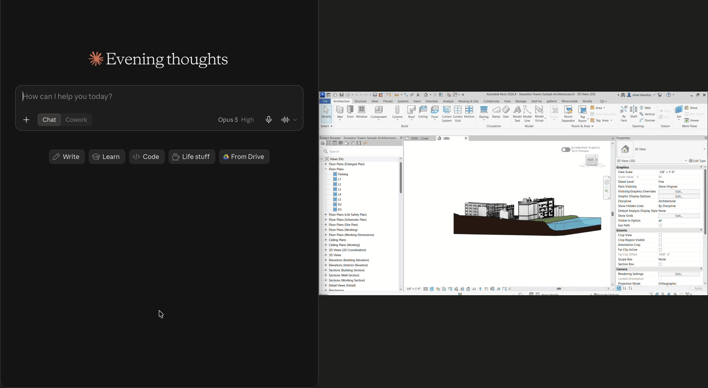
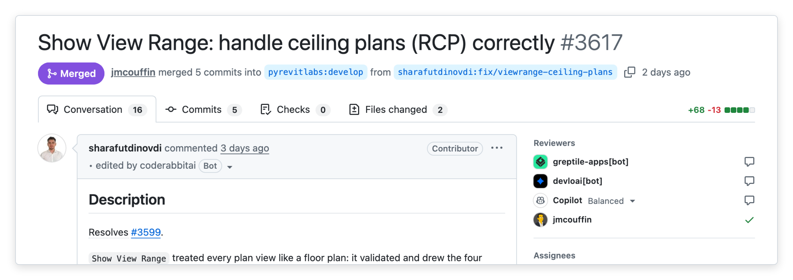
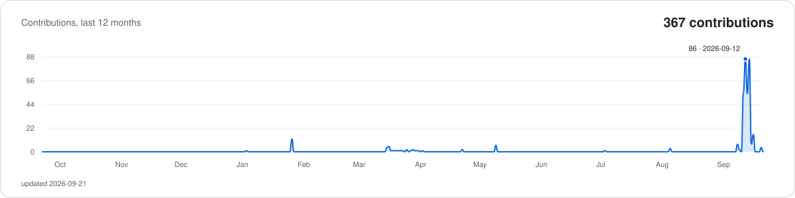

<h1 align="center">Dinar Sharafutdinov</h1>

<strong>BIM / Revit developer.</strong> I turn manual BIM work into tools people use every day: Revit add-ins in C# and .NET across Revit 2022-2026, Dynamo and pyRevit automation, and AI agents that read live Revit models.

  
  
  
  
  

BIM coordinator by day, tool builder by trade. Most of what I write started as a task someone was doing by hand: a model check, a family library, a drawing set laid out view by view. I ship it as software with an installer, an auto-updater and a release pipeline, not as a script on a shared drive.

**Open to contract work** with engineering companies in the EU and remote, from Belgrade, Serbia.

## Featured work

### revit-model-mcp: an AI agent that reads and acts on a live Revit model

An MCP server that gives Claude, Cursor or any MCP client access to the model that is open in Revit right now. Read-only by default: 14 tools for catalog, filtered queries, aggregates, geometry, warnings, relations and view export. Actions are a separate opt-in set behind two gates: select, show, isolate, move, place a family, create a wall, set a parameter, delete, each in its own transaction. The recording above is Claude Desktop on a Mac driving Revit 2026 on a Windows workstation over the network; the server also works locally, over SSH, or through an authenticated HTTP endpoint on the workstation, so a corporate PC can be driven from anywhere with a tunnel. Built for Revit 2022-2026, CI on Windows, 126 core and 120 server tests. `C#` `Revit API` `Python` `MCP` · private until v0.1.0

### [revit-devloader](https://github.com/sharafutdinovdi/revit-devloader): install, update and roll back Revit add-ins without leaving Revit

A development loader for Revit add-ins: versioned payloads verified by SHA-256, immutable run folders so a broken build never touches a working one, GitHub Releases as the feed, and a catalog inside Revit that shows every add-in with its supported Revit years and current state. One core, two hosts: .NET Framework 4.8 for Revit 2022-2024 and .NET 8 for 2025-2026, 141 unit tests, installer and release pipeline on GitHub Actions. `C#` `.NET 4.8 / 8` `WPF` `GitHub Releases` · [v0.1.0 released](https://github.com/sharafutdinovdi/revit-devloader/releases/tag/v0.1.0), MIT

### Upstream contributions to the tools I use

<picture>
  <source media="(prefers-color-scheme: dark)" srcset="assets/pyrevit-pr-3617-dark.png">
  
</picture>

Fixes go upstream, not into private forks: a merged fix in pyRevit (1.9k stars, used by most Revit teams I have worked with), a public API cleanup proposed to Autodesk's own DynamoRevit repository, and housekeeping in RhythmForDynamo. Status badges are live.

| Project | Contribution | Status |
|---|---|---|
| [pyrevitlabs/pyRevit](https://github.com/pyrevitlabs/pyRevit) | [#3617](https://github.com/pyrevitlabs/pyRevit/pull/3617): *Show View Range*, handle ceiling plans (RCP) correctly |  |
| [DynamoDS/DynamoRevit](https://github.com/DynamoDS/DynamoRevit) | [#3433](https://github.com/DynamoDS/DynamoRevit/pull/3433): rename `ScheduleFilter.FiledId` to `FieldId` (public API typo, with obsolete shim) |  |
| [johnpierson/RhythmForDynamo](https://github.com/johnpierson/RhythmForDynamo) | [#111](https://github.com/johnpierson/RhythmForDynamo/pull/111): mark nodes promoted to OOTB Dynamo as obsolete |  |

## Also public

| Repository | What it is | Stack |
|---|---|---|
| [revit-day-by-day](https://github.com/sharafutdinovdi/revit-day-by-day) | Archived learning series: 25 isolated Revit API commands for Revit 2026, one per day | `C#` `.NET 8` |

## DSTools: custom Revit development for engineering companies

[DSTools](https://dstools.online) is my Revit development practice. Two things it delivers:

- **Custom add-ins.** Scoped, built, tested on the client's Revit version, installed and supported. Delivered: **PipelineBuilder** (piping systems modelling from DWG layouts) and **AgrZoning** (zoning plans and areas for the Russian AGR digital model). In development for the Autodesk App Store: **FamilyChecker** and **ModelChecker**. `C#` `.NET 4.8 / 8` `Revit API 2021-2026` `WPF`
- **Revit family libraries.** Parametric MEP and equipment families built to a company's standard: shared parameters, lookup tables, naming, tested in the client's template.

Every add-in ships the same way: installer, auto-updater, versioned releases through GitHub Actions. `Inno Setup` `GitHub Actions`

## How I build

A one-person product with a multi-repo backlog only works if the routine part runs without me, so I develop inside an AI agent pipeline I built and maintain myself, and treat it as infrastructure, not a novelty.

- **Spec before code.** Every task starts as a written spec with explicit scope and acceptance criteria; ambiguity is resolved by a human, not guessed by a model.
- **Roles split across models.** One model plans, reviews and accepts; another implements strictly from the spec. Review blocks on release-critical issues only.
- **Nothing ships unverified.** No task is accepted without a command run and its output shown, for the agents and for me equally.
- **Routine work is a scheduled job.** Release pipelines, weekly reports, health checks and digests run on GitHub Actions cron and report into Telegram.

## Stack

           

## Activity

<picture>
  <source media="(prefers-color-scheme: dark)" srcset="assets/activity-dark.svg">
  
</picture>

The graph is generated from the GitHub GraphQL API by <a href="scripts/activity-graph.mjs">scripts/activity-graph.mjs</a> and refreshed daily by a GitHub Actions cron, no third-party card service.

## Contact

The fastest way to reach me is [sharafutdinov.online](https://sharafutdinov.online), [LinkedIn](https://www.linkedin.com/in/sharafutdinovdi) or [sharafutdinov.di.dev@outlook.com](mailto:sharafutdinov.di.dev@outlook.com).
