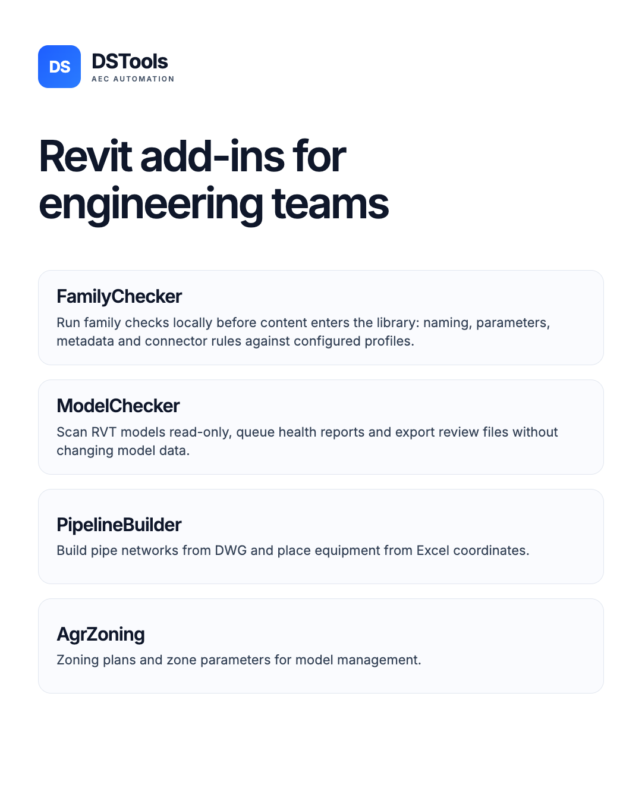

<h1 align="center">Dinar Sharafutdinov</h1>

<strong>BIM / Revit developer.</strong> I turn manual BIM work into tools people use every day: Revit add-ins in C# and .NET across Revit 2022-2027, Autodesk Forma extensions in TypeScript, Dynamo and pyRevit automation, and AI agents that read live Revit models.

  

  
  
  
  
  

BIM coordinator by day, tool builder by trade. Most of what I write started as a task someone was doing by hand: a model check, a family library, a drawing set laid out view by view. I ship it as software with an installer, an auto-updater and a release pipeline, not as a script on a shared drive.

**Open to work.** Contract or full-time, remote from Belgrade, Serbia, for engineering companies in the EU and the Gulf. Revit and Forma development, BIM coordination, in-house tooling.

## Featured work

###  [revit-model-mcp](https://github.com/sharafutdinovdi/revit-model-mcp): an AI agent that reads and acts on a live Revit model

An MCP server that gives Claude, Cursor or any MCP client access to the model that is open in Revit right now. Read-only by default: 18 tools for catalog, filtered queries, aggregates, element details, warnings, relations, view export and coordinator checks. Actions are a separate opt-in set of 9 tools behind two gates, each in its own transaction with a `dry_run` preview and post-commit verification: select, show, isolate, move, place a family, create a wall, set a parameter, delete, batch. I run it from Claude Desktop on a Mac and connect to the Revit workstation over SSH; local and HTTP modes are there as well. Built for Revit 2022-2027, CI on Windows, 112 add-in tests and 67 server tests. `C#` `Revit API` `Python` `MCP` · MIT

  
  
  
  

###  [revit-devloader](https://github.com/sharafutdinovdi/revit-devloader): install, update and roll back Revit add-ins without leaving Revit

A development loader for Revit add-ins, built the way pyRevit treats bundles: a plugin is a package with a manifest, assemblies per Revit year and an icon; the DevLoader ribbon panel is generated from installed packages; a feed is the registry of a delivery channel. Versioned packages verified by SHA-256, immutable run folders so a broken build never touches a working one, install, update and uninstall inside Revit without a restart for command plugins. One core, two hosts: .NET Framework 4.8 for Revit 2022-2024 and .NET 8 for 2025-2026, three sample plugins to start from, 120 unit tests, user and admin installers and a release pipeline on GitHub Actions. `C#` `.NET 4.8 / 8` `WPF` `GitHub Releases` · [releases](https://github.com/sharafutdinovdi/revit-devloader/releases/latest), MIT

###  [Autodesk Forma toolchain](https://github.com/sharafutdinovdi/forma-zoning-check): a zoning extension and the kit it grew into

**[forma-zoning-check](https://github.com/sharafutdinovdi/forma-zoning-check)** checks a Forma proposal against its plot controls — floor area ratio, site coverage, building height, setbacks — and generates the permitted envelope over the site. Presets ship for Dubai, Riyadh, Serbia, Germany, the Netherlands and Spain, so the rule set is the jurisdiction's, not mine. Built on the Forma embedded-view SDK with the native Autodesk design system, so it looks like a part of Forma rather than an iframe.

Everything reusable was pulled out of it and published, because the next extension should not start from an empty folder:

| Package | What it does |
|---|---|
|  | `npm create forma-extension@latest my-extension` — a working extension, zero runtime dependencies |
|  | Host adapter: proposal snapshots, base-group classification, footprint provider chain, cross-panel channel |
| [autodesk-forma-extension-template](https://github.com/sharafutdinovdi/autodesk-forma-extension-template) | The Vite + TypeScript template the scaffolder generates, also usable with *Use this template* |

`TypeScript` `Vite` `Forma embedded-view SDK` `npm` · MIT

### Upstream contributions

| Project | Contribution | Status |
|---|---|---|
| [pyrevitlabs/pyRevit](https://github.com/pyrevitlabs/pyRevit) | [#3617](https://github.com/pyrevitlabs/pyRevit/pull/3617): *Show View Range*, handle ceiling plans (RCP) correctly |  |
| [autodesk-platform-services/skills](https://github.com/autodesk-platform-services/skills) | [#7](https://github.com/autodesk-platform-services/skills/pull/7): `aps-forma-extension`, a Forma extension development skill for the official APS collection |  |
| [punkpeye/awesome-mcp-servers](https://github.com/punkpeye/awesome-mcp-servers) | [#14398](https://github.com/punkpeye/awesome-mcp-servers/pull/14398): list revit-model-mcp |  |
| [johnpierson/RhythmForDynamo](https://github.com/johnpierson/RhythmForDynamo) | [#111](https://github.com/johnpierson/RhythmForDynamo/pull/111): mark nodes promoted to OOTB Dynamo as obsolete, with an audit of the rest in [#24](https://github.com/johnpierson/RhythmForDynamo/issues/24) |  |
| [Nice3point/revit-skills](https://github.com/Nice3point/revit-skills) | [#5](https://github.com/Nice3point/revit-skills/issues/5): reported the Extensible Storage gap; the maintainer shipped a skill for it |  |

## Also public

| Repository | What it is | Stack |
|---|---|---|
| [forma-zoning-check](https://github.com/sharafutdinovdi/forma-zoning-check) | Autodesk Forma extension: plot control compliance and the permitted envelope, six jurisdiction presets | `TypeScript` `Vite` |
| [create-forma-extension](https://github.com/sharafutdinovdi/create-forma-extension) | One-command scaffolder for Forma extensions, published on npm | `JavaScript` `npm` |
| [forma-extension-kit](https://github.com/sharafutdinovdi/forma-extension-kit) | Reusable read-only host adapter for Forma extensions, published on npm | `TypeScript` `npm` |
| [autodesk-forma-extension-template](https://github.com/sharafutdinovdi/autodesk-forma-extension-template) | Minimal Vite + TypeScript template for Forma Site Design extensions | `TypeScript` `Vite` |
| [revit-day-by-day](https://github.com/sharafutdinovdi/revit-day-by-day) | Archived learning series: 25 isolated Revit API commands for Revit 2026, one per day | `C#` `.NET 8` |

## DSTools: custom Revit development for engineering companies

[DSTools](https://dstools.online) is my Revit development practice. What it delivers:

- **Custom add-ins.** Scoped, built, tested on the client's Revit version, installed and supported. Delivered: **PipelineBuilder** (piping systems modelling from DWG layouts) and **AgrZoning** (zoning plans and areas for the Russian AGR digital model). In development for the Autodesk App Store: **FamilyChecker** and **ModelChecker**. `C#` `.NET 4.8 / 8` `Revit API 2021-2026` `WPF`

The [six-page overview deck](https://sharafutdinov.online/media/dstools/dstools-overview.pdf) walks through the four tools, one screen each: what the window shows, what it checks, what comes out.

Every add-in ships the same way: installer, auto-updater, versioned releases through GitHub Actions. `Inno Setup` `GitHub Actions`

## How I work

- A task starts as a written spec: which files, what changes, how it is verified. The spec is the contract, whoever implements it, a person or a coding agent.
- Implementation and review are separate passes. Review blocks a release only for real problems, otherwise it never converges.
- Nothing is done until the check has run and its output is on the table: a test run, a build, a screenshot of the dialog.
- Routine work is scheduled, not remembered: releases, health checks and weekly reports run on GitHub Actions and report to Telegram.
- Notes and decisions live in a searchable base, so a question answered once is not answered again.

## Stack

              

## Activity

<picture>
  <source media="(prefers-color-scheme: dark)" srcset="assets/activity-dark.svg">
  
</picture>

The graph is generated from the GitHub GraphQL API by <a href="scripts/activity-graph.mjs">scripts/activity-graph.mjs</a> and refreshed daily by a GitHub Actions cron, no third-party card service.

## Contact

The fastest way to reach me is [sharafutdinov.online](https://sharafutdinov.online), [LinkedIn](https://www.linkedin.com/in/sharafutdinovdi) or [sharafutdinov.di.dev@outlook.com](mailto:sharafutdinov.di.dev@outlook.com).
