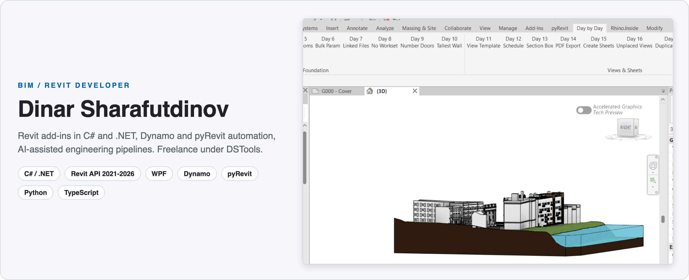

<picture>
  <source media="(prefers-color-scheme: dark)" srcset="assets/hero-dark.png">
  
</picture>

  
  
  
  
  

I build software for the AEC industry: Revit add-ins that validate models and manage family
libraries, desktop tools that ship with real installers and auto-updates, and the Dynamo and
pyRevit automation around them. BIM coordinator by day, tool builder by trade: most of what I
write started as a task someone was doing by hand.

**Open to contract work** on Revit/AEC automation and AI-assisted engineering pipelines.
Based in Belgrade, Serbia · working with teams in the EU and remote.

## Open-source contributions

Upstream work on the Revit / Dynamo ecosystem, the tools I use every day.

| Project | Contribution | Status |
|---|---|---|
| [pyrevitlabs/pyRevit](https://github.com/pyrevitlabs/pyRevit) | [#3617](https://github.com/pyrevitlabs/pyRevit/pull/3617): *Show View Range*, handle ceiling plans (RCP) correctly |  |
| [DynamoDS/DynamoRevit](https://github.com/DynamoDS/DynamoRevit) | [#3433](https://github.com/DynamoDS/DynamoRevit/pull/3433): rename `ScheduleFilter.FiledId` to `FieldId` (public API typo, with obsolete shim) |  |
| [johnpierson/RhythmForDynamo](https://github.com/johnpierson/RhythmForDynamo) | [#111](https://github.com/johnpierson/RhythmForDynamo/pull/111): mark nodes promoted to OOTB Dynamo as obsolete |  |

## Public code

| Repository | What it is | Stack |
|---|---|---|
| [revit-day-by-day](https://github.com/sharafutdinovdi/revit-day-by-day) | Archived learning series: 25 isolated Revit API commands for Revit 2026, one per day | `C#` `.NET 8` `Revit API` |

## DSTools: freelance Revit development

[DSTools](https://dstools.online) is the name I work under as a freelance Revit developer. Two lines of work:

- **Custom add-ins for clients.** Scoped, built, tested on the client's Revit version, installed and supported. Delivered: **PipelineBuilder** (piping systems modelling from DWG layouts) and **AgrZoning** (zoning plans and areas for the Russian AGR digital model). In development for the Autodesk App Store: **FamilyChecker** and **ModelChecker**. `C#` `.NET 4.8 / 8` `Revit API 2021-2026` `WPF`
- **Revit families for companies.** Parametric MEP and equipment families built to a company's standard: shared parameters, lookup tables, naming, tested in the client's template.

Every add-in ships the same way: installer, auto-updater, versioned releases through GitHub Actions. `Inno Setup` `GitHub Actions`

## How I build

A one-person product with a multi-repo backlog only works if the routine part runs without me, so I develop inside an AI agent pipeline I built and maintain myself, and treat it as infrastructure, not a novelty.

- **Spec before code.** Every task starts as a written spec with explicit scope and acceptance criteria; ambiguity is resolved by a human, not guessed by a model.
- **Roles split across models.** One model plans, reviews and accepts; another implements strictly from the spec. Review blocks on release-critical issues only.
- **Nothing ships unverified.** No task is accepted without a command run and its output shown, for the agents and for me equally.
- **Routine work is a scheduled job.** Release pipelines, weekly reports, health checks and digests run on GitHub Actions cron and report into Telegram.

## Stack

           

## Activity

<picture>
  <source media="(prefers-color-scheme: dark)" srcset="assets/activity-dark.svg">
  
</picture>

The graph is generated from the GitHub GraphQL API by <a href="scripts/activity-graph.mjs">scripts/activity-graph.mjs</a> and refreshed daily by a GitHub Actions cron, no third-party card service.

## Contact

The fastest way to reach me is [sharafutdinov.online](https://sharafutdinov.online), [LinkedIn](https://www.linkedin.com/in/sharafutdinovdi) or [sharafutdinov.di.dev@outlook.com](mailto:sharafutdinov.di.dev@outlook.com).
